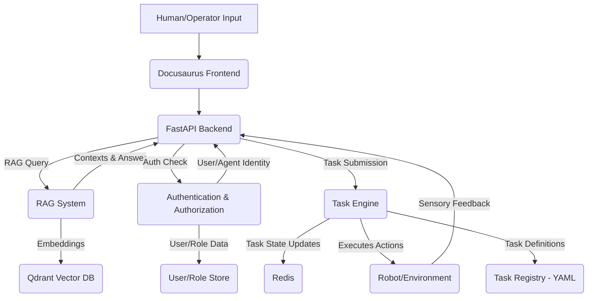

# 01 - Core Concepts and Architecture Deep Dive

## The Need for Intelligent Documentation Systems

In the rapidly evolving field of robotics and AI, systems are becoming increasingly complex. Humanoid robots, in particular, require vast amounts of knowledge to operate effectively, ranging from technical specifications and operational manuals to environmental data and task-specific instructions. Traditional static documentation struggles to keep pace with these demands, often leading to:

- **Information Overload**: Users or even the robots themselves struggle to find relevant information quickly.
- **Outdated Knowledge**: Manual updates are slow, leading to discrepancies between documentation and actual system behavior.
- **Lack of Actionability**: Documentation often describes *what* to do, but doesn't facilitate *how* to do it directly.

This module introduces a novel approach to integrate living documentation with intelligent agents, enabling robots to "read," "understand," and "act" based on their knowledge base.

## Architectural Overview: The Decision-Action Loop

Our intelligent system is built around a "Decision-Action" loop, facilitated by three core components: Retrieval-Augmented Generation (RAG), a robust Authentication and Authorization (Auth) layer, and a flexible Task Engine. These components work in harmony to empower the humanoid robot with contextual understanding, secure operation, and autonomous execution capabilities.

### High-Level System Diagram

### Data Flow

1.  **Human/Operator Input**: Users interact with the Docusaurus frontend, posing questions or initiating commands.
2.  **FastAPI Backend**: Serves as the central API gateway, routing requests to the appropriate services.
3.  **RAG System**:
    *   **Retrieval**: Queries (from the user) are embedded and used to search relevant documentation chunks from the **Qdrant Vector DB**.
    *   **Augmentation**: The retrieved contexts, along with the original query, are sent to a Large Language Model (LLM, e.g., Gemini).
    *   **Generation**: The LLM synthesizes an answer and identifies citations based on the provided contexts.
4.  **Authentication & Authorization**: Before any sensitive operation (like executing a task), the Auth system verifies the identity and permissions of the user or agent.
5.  **Task Engine**:
    *   Receives task definitions (from the user or the RAG system's interpretation).
    *   Orchestrates the execution of steps, manages state in **Redis**, and handles resilience (retries, fallbacks).
    *   Executes actions by interfacing with the **Robot/Environment**.
6.  **Feedback Loop**: Sensory data from the robot or environment can inform subsequent decisions or task adjustments.

## Key Components Explained

### 1. The RAG Brain: Knowledge-Awareness

The Retrieval-Augmented Generation (RAG) system provides our robot with the ability to "understand" its documentation and respond to queries contextually.

-   **Document Ingestion**: Processes vast amounts of raw data (e.g., Markdown files from Docusaurus, PDFs) by extracting content, splitting it into manageable "chunks," and converting these chunks into numerical representations called "embeddings."
-   **Vector Database (Qdrant)**: Stores these embeddings, allowing for rapid semantic searches. Instead of keyword matching, Qdrant finds document sections that are conceptually similar to a given query.
-   **Large Language Model (LLM - Gemini/Ollama)**: Utilizes powerful generative AI to synthesize coherent and contextually relevant answers based on the retrieved information.

### 2. Authentication & Authorization: Secure Operation

Security is paramount in robotics. The Auth layer ensures that only authorized users or agents can perform specific actions.

-   **User Management**: Defines different roles (e.g., Admin, Operator, Viewer) with distinct sets of permissions.
-   **API Keys**: Provides a secure way for programmatic access, enabling other services or external applications to interact with the system without direct user logins.
-   **Access Control (RBAC)**: Role-Based Access Control ensures that actions like "move arm" or "deploy software" are only available to users with the necessary privileges.

### 3. The Task Engine: Autonomous Execution

The Task Engine is the operational core, translating high-level commands into actionable sequences for the robot.

-   **Task Definitions**: Tasks are defined as structured YAML/JSON files, outlining a series of steps, parameters, and conditional logic. This allows for complex workflows to be easily created, managed, and shared.
-   **Task Lifecycle & State Machine**: Each task progresses through defined states (Pending, Running, Completed, Failed), with its progress tracked and persisted in Redis.
-   **Scheduler**: Utilizes a message queue (RQ/Redis) to process tasks asynchronously, ensuring that the system remains responsive even with long-running operations.
-   **Composition & Branching**: Supports sequential steps, parallel execution, and conditional logic, enabling dynamic and adaptive task flows.
-   **Resilience & Monitoring**: Includes built-in mechanisms for retries and fallbacks, ensuring tasks are robust against transient failures. Comprehensive logging and metrics (`Telemetry`) provide insights into task performance and health.

## Interplay: How It All Connects

Imagine an operator asks the humanoid, "How do I recalibrate the gripper?"

1.  The Docusaurus frontend sends this query to the FastAPI backend.
2.  The RAG system retrieves relevant sections from the robot's manual (stored in Qdrant).
3.  The LLM generates an answer, including a step-by-step guide and references to the manual.
4.  The operator sees the instructions. They then might say, "Please perform gripper calibration."
5.  The system, possibly through another RAG query or direct command parsing, identifies a `CalibrateGripper` task definition.
6.  The Auth layer verifies the operator has `execute:task` permission for this task.
7.  The Task Engine is invoked, scheduling the `CalibrateGripper` task.
8.  The task executes a series of pre-defined steps, potentially sending commands to the robot, monitoring its state, and handling any errors or retries.
9.  The operator can monitor the task's progress via a dashboard (powered by the task status API routes).

This integrated approach creates a powerful, intelligent, and secure platform for managing complex robotic systems.
